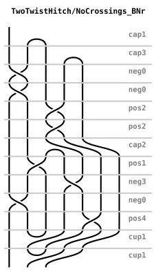
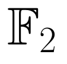
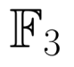
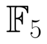

<table>
    <thead>
        <tr>
            <th>Tangle</th>
            <th>Field</th>
	    <th colspan = "3" >Invariant</th>
        </tr>
    </thead>
	<tbody>
	
		<tr>
            <td rowspan = "3" align = "right"> </td>
			<td>  </td>
            <td></td>
			<td></td>
        </tr>
		<tr>
			<td>  </td>
            <td></td>
			<td>	</td>
		</tr>
		<tr>
			<td>  </td>
            <td></td>
			<td></td>
		</tr>
	
	</tbody>
</table>