<table>
    <thead>
        <tr>
            <th>Tangle</th>
            <th>Field</th>
	    <th colspan = "3" >Invariant</th>
        </tr>
    </thead>
	<tbody>
	
		<tr>
            <td rowspan = "3" align = "right"> </td>
			<td>  </td>
            <td><a href="TwoTwistHitch/NoCrossings_BNr0field=2.png">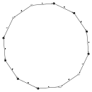</a></td>
			<td><a href="TwoTwistHitch/NoCrossings_BNr1field=2.png">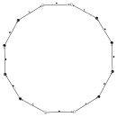</a></td>
			<td><a href="TwoTwistHitch/NoCrossings_BNr2field=2.png">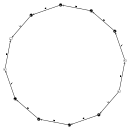</a></td>
			<td></td>
        </tr>
		<tr>
			<td>  </td>
            <td></td>
			<td><a href="TwoTwistHitch/NoCrossings_BNr1field=3.png">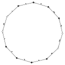</a></td>
			<td><a href="TwoTwistHitch/NoCrossings_BNr2field=3.png">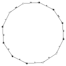</a></td>
			<td></td>
		</tr>
		<tr>
			<td>  </td>
            <td><a href="TwoTwistHitch/NoCrossings_BNr0field=5.png">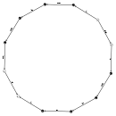</a></td>
			<td><a href="TwoTwistHitch/NoCrossings_BNr1field=5.png">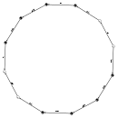</a></td>
			<td><a href="TwoTwistHitch/NoCrossings_BNr2field=5.png">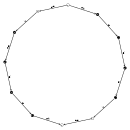</a></td>
			<td></td>
		</tr>
	
		<tr>
            <td rowspan = "3" align = "right"><a href="TwoTwistHitch/+1Crossing_BNr.png">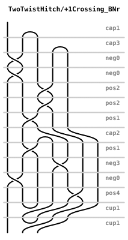</a> </td>
			<td>  </td>
            <td><a href="TwoTwistHitch/+1Crossing_BNr0field=2.png">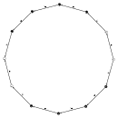</a></td>
			<td><a href="TwoTwistHitch/+1Crossing_BNr1field=2.png">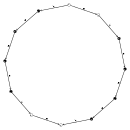</a></td>
			<td><a href="TwoTwistHitch/+1Crossing_BNr2field=2.png">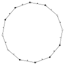</a></td>
			<td></td>
        </tr>
		<tr>
			<td>  </td>
            <td><a href="TwoTwistHitch/+1Crossing_BNr0field=3.png">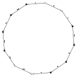</a></td>
			<td><a href="TwoTwistHitch/+1Crossing_BNr1field=3.png">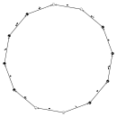</a></td>
			<td><a href="TwoTwistHitch/+1Crossing_BNr2field=3.png">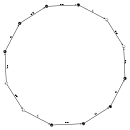</a></td>
			<td></td>
		</tr>
		<tr>
			<td>  </td>
            <td></td>
			<td><a href="TwoTwistHitch/+1Crossing_BNr1field=5.png">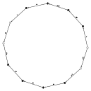</a></td>
			<td><a href="TwoTwistHitch/+1Crossing_BNr2field=5.png">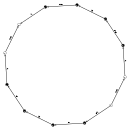</a></td>
			<td></td>
		</tr>
		
		<tr>
            <td rowspan = "3" align = "right"><a href="TwoTwistHitch/+2Crossing_BNr.png">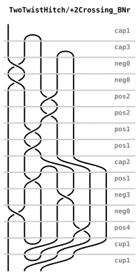</a> </td>
			<td>  </td>
            <td><a href="TwoTwistHitch/+2Crossing_BNr0field=2.png">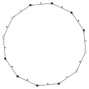</a></td>
			<td><a href="TwoTwistHitch/+2Crossing_BNr1field=2.png">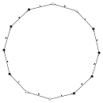</a></td>
			<td><a href="TwoTwistHitch/+2Crossing_BNr2field=2.png">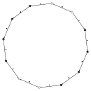</a></td>
			<td></td>
        </tr>
		<tr>
			<td>  </td>
            <td><a href="TwoTwistHitch/+2Crossing_BNr0field=3.png">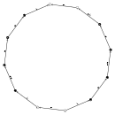</a></td>
			<td><a href="TwoTwistHitch/+2Crossing_BNr1field=3.png">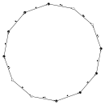</a></td>
			<td></td>
			<td><a href="TwoTwistHitch/+2Crossing_BNr3field=3.png">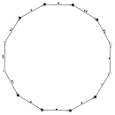</a></td>
		</tr>
		<tr>
			<td>  </td>
            <td><a href="TwoTwistHitch/+2Crossing_BNr0field=5.png">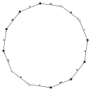</a></td>
			<td><a href="TwoTwistHitch/+2Crossing_BNr1field=5.png">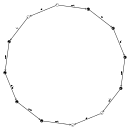</a></td>
			<td><a href="TwoTwistHitch/+2Crossing_BNr2field=5.png">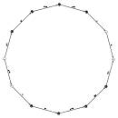</a></td>
			<td></td>
		</tr>
		
		<tr>
            <td rowspan = "3" align = "right"><a href="TwoTwistHitch/+3Crossing_BNr.png">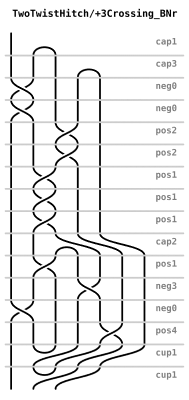</a> </td>
			<td>  </td>
            <td><a href="TwoTwistHitch/+3Crossing_BNr0field=2.png">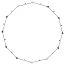</a></td>
			<td><a href="TwoTwistHitch/+3Crossing_BNr1field=2.png">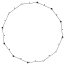</a></td>
			<td><a href="TwoTwistHitch/+3Crossing_BNr2field=2.png">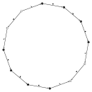</a></td>
			<td></td>
        </tr>
		<tr>
			<td>  </td>
            <td><a href="TwoTwistHitch/+3Crossing_BNr0field=3.png">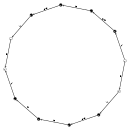</a></td>
			<td><a href="TwoTwistHitch/+3Crossing_BNr1field=3.png">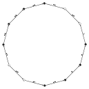</a></td>
			<td><a href="TwoTwistHitch/+3Crossing_BNr2field=3.png">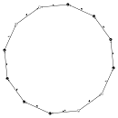</a></td>
			<td></td>
		</tr>
		<tr>
			<td>  </td>
            <td><a href="TwoTwistHitch/+3Crossing_BNr0field=5.png">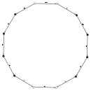</a></td>
			<td><a href="TwoTwistHitch/+3Crossing_BNr1field=5.png">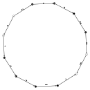</a></td>
			<td><a href="TwoTwistHitch/+3Crossing_BNr2field=5.png">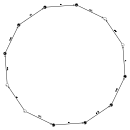</a></td>
			<td></td>
		</tr>
		
		<tr>
            <td rowspan = "3" align = "right"><a href="TwoTwistHitch/+4Crossing_BNr.png">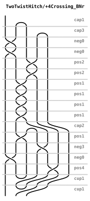</a> </td>
			<td>  </td>
            <td></td>
			<td><a href="TwoTwistHitch/+4Crossing_BNr1field=2.png">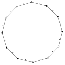</a></td>
			<td><a href="TwoTwistHitch/+4Crossing_BNr2field=2.png">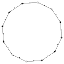</a></td>
			<td></td>
        </tr>
		<tr>
			<td>  </td>
            <td><a href="TwoTwistHitch/+4Crossing_BNr0field=3.png">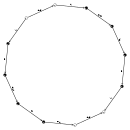</a></td>
			<td><a href="TwoTwistHitch/+4Crossing_BNr1field=3.png">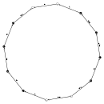</a></td>
			<td></td>
			<td></td>
		</tr>
		<tr>
			<td>  </td>
            <td><a href="TwoTwistHitch/+4Crossing_BNr0field=5.png">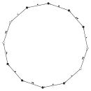</a></td>
			<td><a href="TwoTwistHitch/+4Crossing_BNr1field=5.png">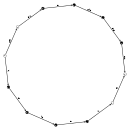</a></td>
			<td><a href="TwoTwistHitch/+4Crossing_BNr2field=5.png">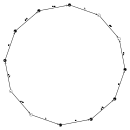</a></td>
			<td></td>
		</tr>
		
		<tr>
            <td rowspan = "3" align = "right"><a href="TwoTwistHitch/-1Crossing_BNr.png">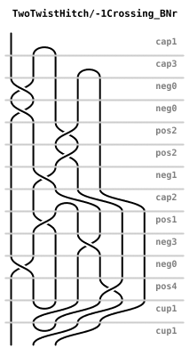</a> </td>
			<td>  </td>
            <td><a href="TwoTwistHitch/-1Crossing_BNr0field=2.png">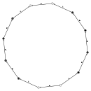</a></td>
			<td><a href="TwoTwistHitch/-1Crossing_BNr1field=2.png">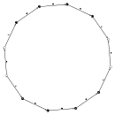</a></td>
			<td><a href="TwoTwistHitch/-1Crossing_BNr2field=2.png">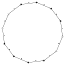</a></td>
			<td></td>
        </tr>
		<tr>
			<td>  </td>
            <td><a href="TwoTwistHitch/-1Crossing_BNr0field=3.png">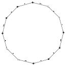</a></td>
			<td></td>
			<td></td>
			<td></td>
		</tr>
		<tr>
			<td>  </td>
            <td></td>
			<td></td>
			<td></td>
			<td></td>
		</tr>
		
		<tr>
            <td rowspan = "3" align = "right"> </td>
			<td>  </td>
            <td></td>
			<td></td>
			<td></td>
			<td></td>
        </tr>
		<tr>
			<td>  </td>
            <td></td>
			<td></td>
			<td></td>
			<td></td>
		</tr>
		<tr>
			<td>  </td>
            <td></td>
			<td></td>
			<td></td>
			<td></td>
		</tr>
	
	</tbody>
</table>