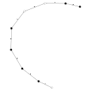

<table>
    <thead>
        <tr>
            <th>Tangle</th>
            <th>Invariant</th>
        </tr>
    </thead>
    <tbody>
        <tr>
            <td rowspan = "3">Tangle </td>
			<td> Field = 2 </td>
            <td></td>
        </tr>
		<tr>
			<td> Field = 3 </td>
            <td></td>
		</tr>
		<tr>
			<td> Field = 4 </td>
            <td></td>
		</tr>
    </tbody>
</table>